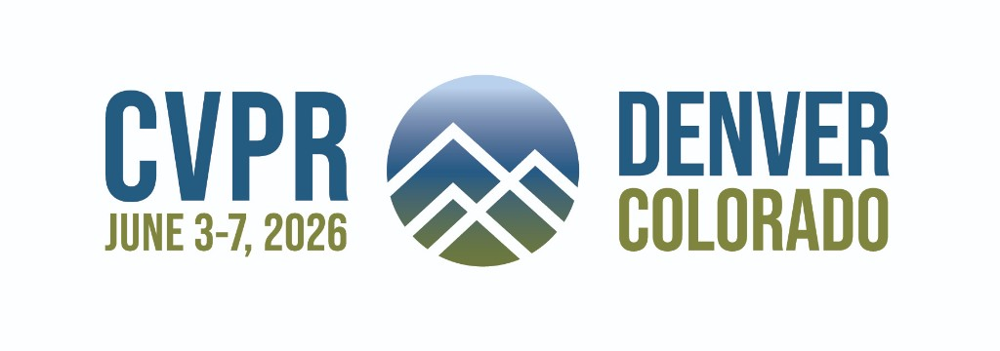
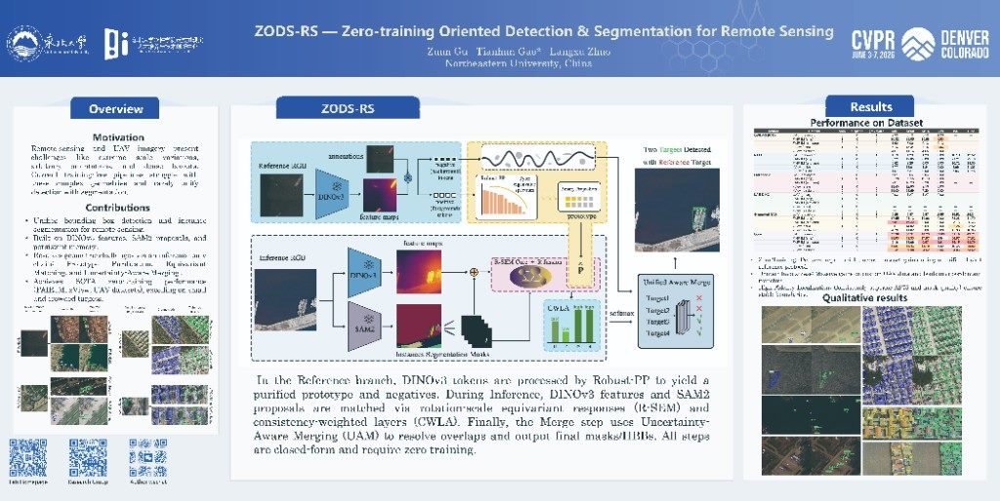

<div align="center">



# ZODS-RS

### Zero-training Oriented Detection and Segmentation for Remote Sensing

**Training-free few-shot instance segmentation for remote sensing imagery, powered by SAM 2 and DINOv3.**

[](https://cvpr.thecvf.com/)
[](https://arxiv.org/abs/2606.10769)
[](https://gzaicebreak.github.io/zods-rs/)

[](https://www.python.org/)
[](https://pytorch.org/)
[](https://github.com/facebookresearch/segment-anything-2)
[](https://github.com/facebookresearch/dinov3)

**Zuan Gu · Tianhan Gao · Langxu Zhao**<br>
Northeastern University, Shenyang, China

[Paper](https://arxiv.org/abs/2606.10769) · [Project Page](https://gzaicebreak.github.io/zods-rs/) · [Installation](#installation) · [Usage](#usage) · [Citation](#citation)

</div>

---

Given as few as **one annotated reference image per category**, ZODS-RS segments every instance of that category in unseen target images—**without training or fine-tuning**. The framework combines scale-aware semantic matching, robust prototype purification, and uncertainty-aware mask merging to transfer visual concepts across challenging remote-sensing scenes.

## Highlights

- **Zero-training adaptation** — no gradient updates; compact reference memories drive category matching.
- **Scale-aware semantic matching** — DINOv3 multi-layer features, SEM / R-SEM, and consistency-weighted layer aggregation (CWLA).
- **Robust prototype purification** — Tyler's M-estimator and Sinkhorn OT variants suppress noisy reference features.
- **Uncertainty-aware mask merging** — Bayesian confidence priors with optional CRF refinement produce coherent instances.
- **Remote-sensing ready outputs** — export binary masks, COCO JSON, oriented bounding boxes (OBB), polygons, and per-instance visualizations.

## Method at a Glance

<div align="center">
  <a href="https://arxiv.org/abs/2606.10769">
    
  </a>
  <br>
  <sub>Click the poster to open the paper. A high-resolution overview is also available on the <a href="https://gzaicebreak.github.io/zods-rs/">project page</a>.</sub>
</div>

## Installation

```bash
# Windows
conda env create -f environment.windows.yml

# Linux
conda env create -f environment.yml

conda activate zods-rs-win

# Install PyTorch matching your CUDA version, for example:
pip install torch torchvision --index-url https://download.pytorch.org/whl/cu121

# Install ZODS-RS (the SAM 2 CUDA extension is optional)
pip install -e .
```

## Model Weights

Weights are **not** included in this repository. Download them separately:

| Model | File | Location |
|---|---|---|
| SAM 2 (Hiera-L) | `sam2_hiera_large.pt` | `./checkpoints/` |
| DINOv3 ViT-L/16 | `model.safetensors` (Hugging Face format) | `./dinov3-vitl16-local/` |

- **SAM 2:** [facebookresearch/segment-anything-2](https://github.com/facebookresearch/segment-anything-2)
- **DINOv3:** [facebookresearch/dinov3](https://github.com/facebookresearch/dinov3) or the Hugging Face Hub

## Data Layout

```text
data/<dataset>/
├── images/                                      # reference + target images
└── annotations/
    ├── custom_references_with_segm_sam21.json   # reference annotations (COCO format)
    ├── custom_references_with_segm.pkl          # memory sampling file
    └── custom_targets.json                      # target image list (COCO format)
```

## Usage

Two example instance configurations are provided under `zods_rs/pl_configs/`:

- `build_dinov3.yaml` — building extraction
- `ship_dinov3.yaml` — ship detection (FAIR1M-style)

The pipeline has three stages, driven by the same configuration:

```bash
CONFIG=zods_rs/pl_configs/ship_dinov3.yaml

# 1. Fill the memory bank with reference features
python run_lightening.py test --config $CONFIG \
    --model.test_mode fill_memory \
    --out_path ./tmp_ckpts/ship/ship_refs_memory.pth

# 2. Post-process the memory bank with prototype purification
python run_lightening.py test --config $CONFIG \
    --model.test_mode postprocess_memory \
    --ckpt_path ./tmp_ckpts/ship/ship_refs_memory.pth \
    --out_path ./tmp_ckpts/ship/ship_refs_memory_postprocessed.pth

# 3. Run inference on target images
python run_lightening.py test --config $CONFIG \
    --model.test_mode test \
    --ckpt_path ./tmp_ckpts/ship/ship_refs_memory_postprocessed.pth
```

For a one-shot end-to-end run on a new image:

```bash
python scripts/process_and_test.py path/to/image.jpg
```

Results—including visualizations, COCO JSON, binary masks, and per-instance crops—are written to `./results_analysis/<dataset>/`.

## Key Configuration Blocks

| Block | Purpose |
|---|---|
| `sem` | Scale-aware semantic matching with multi-scale / multi-layer DINOv3 and optional rotation equivariance |
| `sem.cwla` | Consistency-weighted layer aggregation |
| `memory_bank_cfg.pp` | Prototype purification through robust / OT estimators and clustering |
| `uam` | Uncertainty-aware mask merging with priors, negative prototypes, and CRF |
| `eval.out_format` | Output format: `mask`, `obb`, or `polygon` |

## Repository Structure

```text
zods_rs/              # main package: models, datasets, Lightning wrappers, and configs
modules/              # core algorithm modules: SEM, PP, and UAM
utils/                # priors, calibration, and CLIP adapters
sam2/, sam2_configs/  # SAM 2 (Meta AI, Apache 2.0)
scripts/              # data preparation, batch processing, and visualization tools
tests/                # unit tests for SEM, PP, and UAM
```

## Citation

If ZODS-RS is useful in your research, please cite:

```bibtex
@inproceedings{gu2026zodsrs,
  title         = {{ZODS-RS}: Zero-training Oriented Detection and Segmentation for Remote Sensing},
  author        = {Gu, Zuan and Gao, Tianhan and Zhao, Langxu},
  booktitle     = {Proceedings of the IEEE/CVF Conference on Computer Vision
                   and Pattern Recognition (CVPR) Findings},
  year          = {2026},
  address       = {Nashville, TN, USA},
  eprint        = {2606.10769},
  archivePrefix = {arXiv},
  primaryClass  = {cs.CV},
  note          = {To appear}
}
```

## Acknowledgements

ZODS-RS builds upon [SAM 2](https://github.com/facebookresearch/segment-anything-2) and [DINOv3](https://github.com/facebookresearch/dinov3). We thank the authors for making their work available to the community.

## License

This project includes or builds upon components governed by their respective licenses, including SAM 2 (Apache 2.0) and DINOv3 (Meta AI license). See the corresponding subdirectories and upstream repositories for details.
